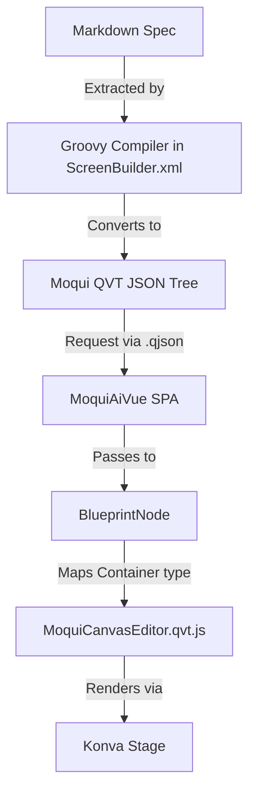

# Work History: MoquiCanvasEditor Integration
**Date:** 2026-04-01
**Component:** `moqui-ai` / `aitree`

## Objective
The primary goal was to integrate the `MoquiCanvasEditor` (a Konva-based visualizer for Moqui screen specifications) into the `aitree` SPA. This allows users to visualize how an AI-generated Markdown specification would be structured in the Moqui framework before actually generating the XML files.

## Accomplishments

### 1. Unified Rendering Pipeline
- **Backend Compilation**: Updated `ScreenBuilder.xml` to include inline Groovy logic that extracts code blocks (XML and Groovy) from Markdown specifications. It wraps these into a single `screen-structure` root for the visualizer.
- **Blueprint Bridge**: Modified `BlueprintClient.js` to allow standard Moqui widgets to be "re-typed" into custom Blueprint components. By setting `type="moqui-canvas-editor"` on a standard Moqui `<container>`, the system now correctly instantiates the Vue visualizer.
- **Protocol Correction**: Fixed the data flow by ensuring `MoquiAiVue` requests `.qjson` (JSON structural tree) instead of defaulting to HTML for standard screens.

### 2. MoquiCanvasEditor Enhancements
- **Robust Data Handling**: Added a computed `resolvedData` property that automatically parses the `screen-data` prop regardless of whether it arrives as a structured JSON object or a raw string (common in XML attribute passing).
- **Premium Visualization**:
    - **Interactive Canvas**: Implemented Konva-based zoom (mouse wheel) and stage panning (drag-to-move).
    - **Background Grid**: Added a subtle grid background for a professional "Editor" look.
    - **Smart Color Coding**: Mapped widget types to specific color schemes (Green for forms, Orange for containers, Purple for logic, Indigo for links).
    - **Draggable Nodes**: All rendered widgets are individual Konva groups that can be rearranged manually on the canvas.

### 3. Integrated Debugging & Reliability
- **Retry Mechanism**: Implemented a retry loop for component registration to ensure `MoquiCanvasEditor` correctly attaches to `moqui.webrootVue` even if the JS file loads before the main SPA is initialized.
- **Transparent Wrapper**: The visualizer now automatically handles the `screen-structure` root node, displaying the actual screen content as top-level elements.

## Architecture Diagram (Logical)

## Known Context for Future Evolution
- **Nesting**: The `drawNode` method handles recursion, correctly nesting child components inside their parents.
- **Attributes**: Widget labels are dynamically generated from node name and identifying attributes (e.g., `id`, `text`).
- **Pathing**: The visualizer is currently mounted at `/aitree/ScreenBuilder`.

## Files of Interest
- `runtime/component/moqui-ai/screen/moquiai/js/MoquiCanvasEditor.qvt.js`
- `runtime/component/moqui-ai/screen/moquiai/js/BlueprintClient.js`
- `runtime/component/aitree/screen/aitree/ScreenBuilder.xml`
